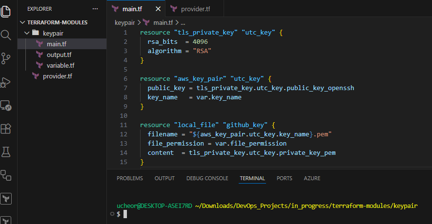
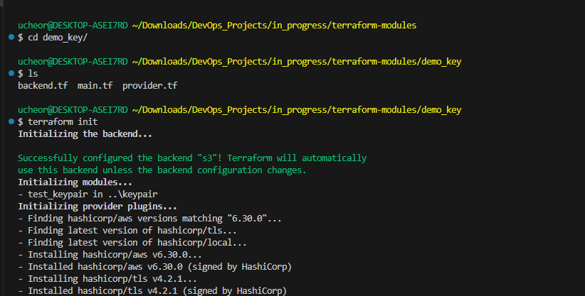
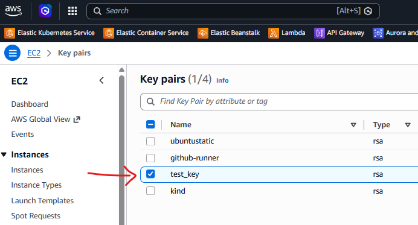

# Why AWS Key Pairs Matter: Defense for Your EC2 Instances

When launching an EC2 instance in Amazon Web Services (AWS), one of the first things AWS asks you to configure is a Key Pair.

This step can feel like just another required configuration during instance creation especially if you are manually creating resources from the AWS console — something you quickly click through before launching the server. In reality, AWS key pairs are one of the most important security mechanisms for accessing and protecting your infrastructure.

They form the foundation of how engineers securely connect to cloud servers. Understanding how key pairs work—and how to manage them properly—is essential for anyone working in cloud computing, DevOps, or infrastructure engineering. In this article, we'll explore how keypairs work and if you are up to it, there is a quick demo of how to set one up using Infrastructure as Code (Terraform).

---

## What Is an AWS Key Pair?

An AWS Key Pair is a set of cryptographic keys used to securely authenticate and connect to EC2 instances.

It consists of two components:

**Public Key**

- Stored securely by AWS

- Automatically placed on the EC2 instance during launch

- Used by the instance to verify incoming authentication requests

**Private Key**

- Downloaded by the user as a .pem or .ppk file when the key pair is created

- Stored securely on your local machine or in a secure key vault

- Used to authenticate when connecting to the instance

This authentication model is based on SSH public-key cryptography, which is significantly more secure than traditional password-based authentication. Instead of transmitting passwords across the network, the system uses cryptographic verification to confirm a user's identity.

---

## Why AWS Key Pairs Are Important

1. <u>Passwordless Authentication</u>

Instead of logging into servers using usernames and passwords, AWS relies on SSH key authentication.

This approach greatly reduces the risk of common security issues such as:

- brute force attacks

- weak or reused passwords

- credential leaks or compromised password databases

With key-based authentication, only someone who possesses the correct private key can access the server, making unauthorized access significantly more difficult.

2. <u>Strong Encryption</u>

AWS key pairs use asymmetric encryption, which means the public key and private key are mathematically linked but serve different purposes.

The public key can be safely stored on the server, while the private key must remain confidential with the user. Even if someone gains access to the public key, they cannot reverse-engineer it to generate the private key.

This makes asymmetric encryption a powerful and widely trusted security mechanism used across many modern systems, including SSH, TLS, and secure web communications.

3. <u>Secure Infrastructure Access</u>

In most environments, engineers connect to EC2 instances using an SSH command similar to:

```
ssh -i my-key.pem ec2-user@public-ip
```

During this process, the SSH client uses the private key to prove the user's identity to the EC2 instance. The server then checks the corresponding public key stored in the instance's authorized_keys file.

Because no password is transmitted over the network, this method provides secure authentication even across public internet connections.

4. <u>Integration With Infrastructure as Code</u>

In modern DevOps environments, infrastructure is often provisioned and managed using Infrastructure as Code (IaC) tools.

Key pairs can be integrated directly into automation workflows using Infrastructure as Code tools such as Terraform. Managing key pairs through IaC allows teams to standardize infrastructure deployments, automate provisioning, and maintain consistent access control across multiple environments. In Terraform you can define an AWS key pair resource like this:

```
touch keypair.tf
```
```
resource "tls_private_key" "utc_key" {
  rsa_bits  = 4096
  algorithm = "RSA"
}

resource "aws_key_pair" "utc_key" {
  public_key = tls_private_key.utc_key.public_key_openssh
  key_name   = "key_name" #can switch to any name you prefer
}

resource "local_file" "github_key" {
  filename = "${aws_key_pair.utc_key.key_name}.pem"
  file_permission = "0400"
  content  = tls_private_key.utc_key.private_key_pem
}
```



```
touch provider.tf
```
```
terraform {
  required_providers {
    aws = {
        source = "hashicorp/aws"
        version = "6.30.0"
    }
  }
}

provider "aws" {
  region = "us-east-1"
}
```
To provision keypair on your AWS account, terraform init, terraform validate, terraform plan, terraform apply as required. 

Feel free to configure your provider details and set up your backend as needed. You can refer to **https://github.com/ucheor/AWS_Keypair_Best_Practices_QR.git** if needed.

If you are running your terraform commands using the files from the gitHub repository, remember to switch into the demo_folder, update your bucket name and provider as needed, before initializing terraform providers. Note that your private key will be downloaded to your local repository. Always protect your private key.

---



---



---

## Best Practices for AWS Key Pairs

Because key pairs provide direct access to your infrastructure, it is important to follow strong security practices.

**Protect Your Private Key**

Your private key should always be stored securely.
Never upload .pem files to public repositories or share them through insecure channels.

**Restrict Key Permissions**

Private keys should have restricted file permissions so only the owner can read them:
```
chmod 400 my-key.pem
```

**Use Separate Keys for Each Environment**

Using different keys for development, staging, and production environments helps isolate access and reduce risk.

**Rotate Keys Periodically**

Regularly rotating keys ensures that older credentials do not remain active indefinitely and reduces potential exposure.

**Consider AWS Systems Manager Session Manager**

In many environments, teams are now using AWS Systems Manager Session Manager to connect to instances without requiring SSH keys or opening inbound ports. This can further enhance security and auditing capabilities.

---

## A Common Mistake Engineers Make

One of the most common mistakes engineers make is losing the private key file.

AWS does not store the private key, meaning it cannot be recovered once lost. The private key is only available for download at the time the key pair is created.

If the key is lost, recovery typically involves:

- Creating a new key pair

- Attaching the instance’s root volume to another EC2 instance

- Manually editing the authorized_keys file to add the new public key

This process can be time-consuming and disruptive, which is why secure key storage and management practices are critical.

---


## Final Thoughts

AWS key pairs may appear to be a small configuration detail when launching an EC2 instance, but they actually play a critical role in securing cloud infrastructure.

They provide:

- strong cryptographic authentication

- passwordless access to servers

- secure remote management of EC2 instances

For anyone working in cloud engineering, DevOps, or infrastructure management, understanding how AWS key pairs work—and how to manage them properly—is a fundamental skill.

Because in the cloud, security always begins with access control—and that access often starts with a single key file.

---

*Feel free to offer your insight! What other best practice are you adopting in your process?*